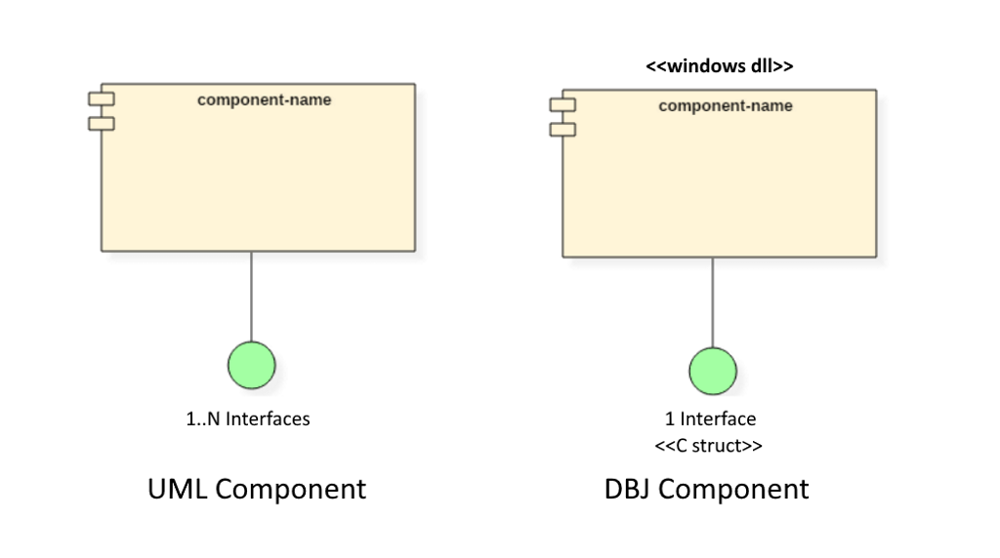

# dbj-dll&trade;

&copy; by dbj@dbj.org

## DBJ DLL Component

Simple but real Component architecture, design and implementation.  Using the [DLL concept and mechanism as implemented in Windows](https://en.wikipedia.org/wiki/Dynamic-link_library).

Component is a software building block. Some more formal details in [here](https://www.guru99.com/component-diagram-uml-example.html), please.

## But, what is this "dbj component"?



- one dbj component is one dll
- one dbj component has and implements one interface
- interface is a collection of functions and types 

All that seems very OO. That is because it is. Those are the foundations of OO.
The concept of "information hiding". (Hide the implementation complexity) Architected, designed and implemented following the "Encapsulation and Decoupling" principle (easily moved, swapped or changed). Without the unfortunate cruft piled up through the OO history of misunderstandings.

[That link above](https://en.wikipedia.org/wiki/Dynamic-link_library), leads to a good text on DLL's and concept and benefits included. Please read it. Recap:

## Operational requirements

- Windows is the OS
- C is the language of Windows
- One C struct is the interface on one DBJ DLL Component
- Function pointers on that struct are interface functions.

## Wot? Is that all?!

Basically that is all that matters. Use DBJ DLL Components ubiquitously and the benefits will be clear. You will develop and deliver resilient applications made of nicely isolated, ABI safe, extremely simple components. Without the modern C++, COM, IDL and all that paraphernalia from the development horror basement. Especially if you stick to [standard C](http://www.open-std.org/jtc1/sc22/wg14/).

## Nothing is better than seeing the code

Here is the `dbjsysloglib` [included usage example](https://github.com/dbj-data/dbjsysloglib/tree/master/try). This is C and those are Win32 types and 'things' in there.

DBJ DLL functions and macros are prefixed with `dbj_dll_`.

```cpp
// particular component interface 
// is one C struct in this case
// implemented in this header
#include "../dll/dbjsyslogclient.h" 

// dbj dll usage helpers
#include <dbj-dll/dbj-dlluser.h>

// somewhere in your code
// dbj dll has to be dynamically loaded
// dbj dll needs no lib
HINSTANCE dll_hinst_ = dbj_dll_load(DBJSYSLOGCLIENT_DLL_NAME);

if (dll_hinst_)
// optional report on the dll version
  dbj_dll_version_report(
    dll_hinst_, 
    sizeof(DBJSYSLOGCLIENT_DLL_NAME),
    DBJSYSLOGCLIENT_DLL_NAME
  );
else
// dll is not found
  return EXIT_FAILURE;  
```
 **Security**: you should not place your dll's wherever you want, including the system folders. Thus no path in the dll name please. Just the dll base name.
 ```cpp
 // place the dll where your exe is
 #define DBJSYSLOGCLIENT_DLL_NAME \
 "dbjsyslogclient.dll"
 ```
 In debug builds errors are already reported; if any. One can see them in the debugger console. Thus no need for the console application debug builds. Just debug step using Visual Studio or VS Code. Next, onto the normal usage.
 ```cpp
  // 1. obtain the factory function
  dbjsyslog_client_ifp dll_factory_ =
  // need to cast here
  (dbjsyslog_client_ifp)dbj_dll_get_factory_function
  (  &dll_hinst_  );

  assert(dll_factory_);
 ```
 ### The DBJ Component def file. Must always be part of the project and have this content:
 
 Factory function alway has the same name, as defined in the always repeating [dbj dll def file](copy_rename_to_individual_components.def). Here by name we mean name as the string, not the function declaration.  Let's have it here to:
  
 ```
EXPORTS
dbj_dll_component_can_unload_now    PRIVATE
dbj_dll_interface_factory           PRIVATE
dbj_dll_component_version           PRIVATE
 ```
 Those are the required exact names of three functions every DBJ Component has to implement.
 
### Back to explanation 
Thus above you cast the result to the particular factory function pointer type. The only role of it is to return the single interface pointer implemented inside the component. (and that "interface" is just an plain old  C struct )
 ```cpp
// 2. call the factory function to obtain the interface
// pointer; no more casting
dbjsyslog_client* iface_ = dll_factory_();

assert(iface_);
// make sure not to free that pointer
 ```
 We are now ready to use that component implementing the [syslog](https://en.wikipedia.org/wiki/Syslog) client on windows. A single struct inside [dbjsyslog header](https://github.com/dbj-data/dbjsysloglib/blob/master/dll/dbjsyslogclient.h) declares the interface and methods available. 

 ```cpp
iface_->dbj_syslog_initalize(0, "dbjsyslog testing");
iface_->info("Using dbj syslog: %s", dbj_syslog_VERSION );

// 3. call the methods available
iface_->dbj_syslog_initalize(0, 0);
iface_->emergency("%s", "Emergency!");
iface_->alert("%s", "Alert!");
iface_->critical("%s", "Critical!");
iface_->error("%s", "Error!");
iface_->warning("%s", "Warning!");
iface_->info("Using dbj syslog: %s", dbj_syslog_VERSION );
iface_->debug("%s", "Debug!");
 ```
Obviously users are free to invent and use more (or less) macros for their particular needs. 

## Simple headers in here are extensively documented
Two are important:

- `dbj-dllimp.h`
  - to be used inside the dbj dll component implementation
- `dbj-dlluser.h`
  - to be used by dbj dll component client code

More simple and effective real life examples of both implementation and usage are coming soon.

There are already few pretty useful DBJ DLL Components: 

- https://github.com/dbj-data/dbjsysloglib


> Linux shared objects are on the roadmap.

---------------------------------------------------------------------  

[](http://www.dbj.org "dbj")  
